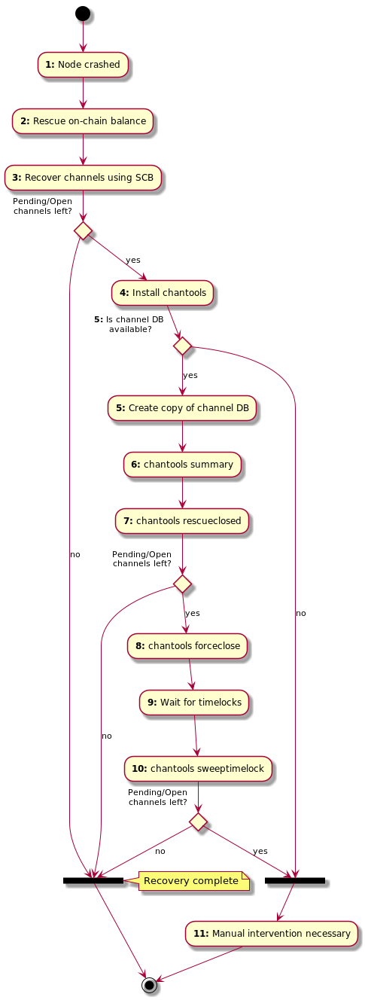

# Channel tools

## Index

* [Installation](#installation)
* [Channel recovery scenario](#channel-recovery-scenario)
* [Seed and passphrase input](#seed-and-passphrase-input)
* [Command overview](#command-overview)
* [Commands](#commands)

This tool provides helper functions that can be used to rescue funds locked in
`lnd` channels in case `lnd` itself cannot run properly anymore.

**WARNING**: This tool was specifically built for a certain rescue operation and
might not be well-suited for your use case. Or not all edge cases for your needs
are coded properly. Please look at the code to understand what it does before
you use it for anything serious.

**WARNING 2**: This tool will query public block explorer APIs for some
commands, your privacy might not be preserved. Use at your own risk or supply
a private API URL with `--apiurl`.

## Installation

The easiest way to install `chantools` is to [download a pre-built binary for
your operating system and architecture](https://github.com/guggero/chantools/releases).

Example (make sure you always use the latest version!):

```shell
$ cd /tmp
$ wget -O chantools.tar.gz https://github.com/guggero/chantools/releases/download/v0.10.4/chantools-linux-amd64-v0.10.4.tar.gz
$ tar -zxvf chantools.tar.gz
$ sudo mv chantools-*/chantools /usr/local/bin/
```

### Compile from source

If there isn't a pre-built binary for your operating system or architecture
available or you want to build `chantools` from source for another reason, you
need to make sure you have `go 1.16.x` (or later) and `make` installed and can
then run the following commands:

```bash
git clone https://github.com/guggero/chantools.git
cd chantools
make install
```

## Channel recovery scenario

The following flow chart shows the main recovery scenario this tool was built
for. This scenario assumes that you do have access to the crashed node's seed,
`channel.backup` file and some state of a `channel.db` file (perhaps from a
file based backup or the recovered file from the crashed node).

Following this guide will help you get your channel **funds** back! The channels
themselves can't be restored to work normally unless step 1 is successful (
compacting the DB).



**Explanation:**

1. **Node crashed**: For some reason your `lnd` node crashed and isn't starting
  anymore. If you get errors similar to
  [this](https://github.com/lightningnetwork/lnd/issues/4449),
  [this](https://github.com/lightningnetwork/lnd/issues/3473) or
  [this](https://github.com/lightningnetwork/lnd/issues/4102), it is possible
  that a simple compaction (a full copy in safe mode) can solve your problem.
  See [`chantools compactdb`](doc/chantools_compactdb.md).
  <br/><br/>
  If that doesn't work and you need to continue the recovery, make sure you can
  at least extract the `channel.backup` file and if somehow possible any version
  of the `channel.db` from the node.
  <br/><br/>
  Whatever you do, do **never, ever** replace your `channel.db` file with an old
  version (from a file based backup) and start your node that way.
  [Read this explanation why that can lead to loss of funds.](https://github.com/lightningnetwork/lnd/blob/master/docs/safety.md#file-based-backups)

2. **Rescue on-chain balance**: To start the recovery process, we are going to
  re-create the node from scratch. To make sure we don't overwrite any old data
  in the process, make sure the old data directory of your node (usually `.lnd`
  in the user's home directory) is safely moved away (or the whole folder
  renamed) before continuing.<br/>
  To start the on-chain recovery, [follow the sub step "Starting On-Chain Recovery" of this guide](https://github.com/lightningnetwork/lnd/blob/master/docs/recovery.md#starting-on-chain-recovery).
  Don't follow the whole guide, only this single chapter!
  <br/><br/>
  This step is completed once the `lncli getinfo` command shows both
  `"synced_to_chain": true` and `"synced_to_graph": true` which can take several
  hours depending on the speed of your hardware. **Do not be alarmed** that the
  `lncli getinfo` command shows 0 channels. This is normal as we haven't started
  the off-chain recovery yet.

3. **Recover channels using SCB**: Now that the node is fully synced, we can try
  to recover the channels using the [Static Channel Backups (SCB)](https://github.com/lightningnetwork/lnd/blob/master/docs/safety.md#static-channel-backups-scbs).
  For this, you need a file called `channel.backup`. Simply run the command
  `lncli restorechanbackup --multi_file <path-to-your-channel.backup>`. **This
  will take a while!**. The command itself can take several minutes to complete,
  depending on the number of channels. The recovery can easily take a day or
  two as a lot of chain rescanning needs to happen. It is recommended to wait at
  least one full day. You can watch the progress with the `lncli pendingchannels`
  command. If the list is empty, congratulations, you've recovered all channels!
  If the list stays un-changed for several hours, it means not all channels
  could be restored using this method.
  [One explanation can be found here.](https://github.com/lightningnetwork/lnd/blob/master/docs/safety.md#zombie-channels)

4. **Install chantools**: To try to recover the remaining channels, we are going
  to use `chantools`. Simply [follow the installation instructions.](#installation)
  The recovery can only be continued if you have access to some version of the
  crashed node's `channel.db`. This could be the latest state as recovered from
  the crashed file system, or a version from a regular file based backup. If you
  do not have any version of a channel DB, `chantools` won't be able to help
  with the recovery. See step 11 for some possible manual steps.

5. **Create copy of channel DB**: To make sure we can read the channel DB, we
  are going to create a copy in safe mode (called compaction). Simply run
  <br/><br/>
  `chantools compactdb --sourcedb <recovered-channel.db> --destdb ./results/compacted.db`
  <br/><br/>
  We are going to assume that the compacted copy of the channel DB is located in
  `./results/compacted.db` in the following commands.

6. **chantools summary**: First, `chantools` needs to find out the state of each
  channel on chain. For this, a blockchain API (by default [blockstream.info](https://blockstream.info))
  is queried. The result will be written to a file called
  `./results/summary-yyyy-mm-dd.json`. This result file will be needed for the
  next command.
  <br/><br/>
  `chantools --fromchanneldb ./results/compacted.db summary`

7. **chantools rescueclosed**: It is possible that by now the remote peers have
  force-closed some of the remaining channels. What we now do is try to find the
  private keys to sweep our balance of those channels. For this we need a shared
  secret which is called the `commit_point` and is changed whenever a channel is
  updated. We do have the latest known version of this point in the channel DB.
  The following command tries to find all private keys for channels that have
  been closed by the other party. The command needs to know what channels it is
  operating on, so we have to supply the `summary-yyy-mm-dd.json` created by the
  previous command:
  <br/><br/>
  `chantools --fromsummary ./results/<summary-file-created-in-last-step>.json rescueclosed --channeldb ./results/compacted.db`
  <br/><br/>
  This will create a new file called `./results/rescueclosed-yyyy-mm-dd.json`
  which will contain any found private keys and will also be needed for the next
  command. Use `bitcoind` or Electrum Wallet to sweep all of the private keys.

8. **chantools forceclose**: This command will now close all channels that
  `chantools` thinks are still open. This is achieved by publishing the latest
  known channel state of the `channel.db` file.
  <br/>**Please read the full warning text of the
  [`forceclose` command below](doc/chantools_forceclose.md) as this command can put
  your funds at risk** if the state in the channel DB is not the most recent
  one. This command should only be executed for channels where the remote peer
  is not online anymore.
  <br/><br/>
  `chantools --fromsummary ./results/<rescueclosed-file-created-in-last-step>.json forceclose --channeldb ./results/compacted.db --publish`
  <br/><br/>
  This will create a new file called `./results/forceclose-yyyy-mm-dd.json`
  which will be needed for the next command.
  <br/><br/>
  If you get the error `non-mandatory-script-verify-flag (Signature must be zero
  for failed CHECK(MULTI)SIG operation)`, you might be affected by an old bug
  of `lnd` that was fixed in the meantime. But it means the signature in the
  force-close transaction is invalid and needs to be fixed. There is [a guide
  on how to do exactly that here](doc/fix-commitment-tx.md).

9. **Wait for timelocks**: The previous command closed the remaining open
  channels by publishing your node's state of the channel. By design of the
  Lightning Network, you now have to wait until the channel funds belonging to
  you are not time locked any longer. Depending on the size of the channel, you
  have to wait for somewhere between 144 and 2000 confirmations of the
  force-close transactions. Only continue with the next step after the channel
  with the highest `csv_delay` has reached that many confirmations of its
  closing transaction. You can check this by looking up each force closed
  channel transaction on a block explorer (like 
  [blockstream.info](https://blockstream.info) for example). Open the result
  JSON file of the last command (`./results/forceclose-yyyy-mm-dd.json`) and
  look up every TXID in `"force_close" -> "txid"` on the explorer. If the number
  of confirmations is equal to or greater to the value shown in
  `"force_close" -> "csv_delay"` for each of the channels, you can proceed.

10. **chantools sweeptimelock**: Once all force-close transactions have reached
  the number of transactions as the `csv_timeout` in the JSON demands, these
  time locked funds can now be swept. Use the following command to sweep all the
  channel funds to an address of your wallet:
  <br/><br/>
  `chantools --fromsummary ./results/<forceclose-file-created-in-last-step>.json sweeptimelock --publish --sweepaddr <bech32-address-from-your-wallet>`

11. **Manual intervention necessary**: You got to this step because you either
  don't have a `channel.db` file or because `chantools` couldn't rescue all your
  node's channels. There are a few things you can try manually that have some
  chance of working:
    - Make sure you can connect to all nodes when restoring from SCB: It happens
    all the time that nodes change their IP addresses. When restoring from a
    static channel backup, your node tries to connect to the node using the IP
    address encoded in the backup file. If the address changed, the SCB restore
    process doesn't work. You can use block explorers like [1ml.com](https://1ml.com)
    to try to find an IP address that is up-to-date. Just run
    `lncli connect <node-pubkey>@<updated-ip-address>:<port>` in the recovered
    `lnd` node from step 3 and wait a few hours to see if the channel is now
    being force closed by the remote node.
    - Find out who the node belongs to: Maybe you opened the channel with someone
    you know. Or maybe their node alias contains some information about who the
    node belongs to. If you can find out who operates the remote node, you can
    ask them to force-close the channel from their end. If the channel was opened
    with the `option_static_remote_key`, (`lnd v0.8.0` and later), the funds can
    be swept by your node.

12. **Use Zombie Channel Recovery Matcher**: As a final, last resort, you can
  go to [node-recovery.com](https://www.node-recovery.com/) and register your
  node's ID for being matched up against other nodes with the same problem.
  <br/><br/>
  Once you were contacted with a match, follow the instructions on the
  [Zombie Channel Recovery Guide](doc/zombierecovery.md) page.
  <br/><br/>
  If you know the peer of a zombie channel and have a way to contact them, you
  can also skip the registration/matching process and [create your own match
  file](doc/zombierecovery.md#file-format).

## Seed and passphrase input

All commands that require the seed (and, if set, the seed's passphrase) offer
three distinct possibilities to specify it:
1. **Enter manually on the terminal**: This is the safest option as it makes
  sure that the seed isn't stored in the terminal's command history.
2. **Pass the extened master root key as parameter**: This is added as an option
  for users who don't have the full seed anymore, possibly because they used
  `lnd`'s `--noseedbackup` flag and extracted the `xprv` from the wallet
   database with the `walletinfo` command. Those users can specify the master
   root key by passing the `--rootkey` command line flag to each command that
   requires the seed.
3. **Use environment variables**: This option makes it easy to automate usage of
  `chantools` by removing the need to type into the terminal. There are three
  environment variables that can be set to skip entering values through the
  terminal:
    - `AEZEED_MNEMONIC`: Specifies the 24 word `lnd` aezeed.
    - `AEZEED_PASSPHRASE`: Specifies the passphrase for the aezeed. If no
      passphrase was used during the creation of the seed, the special value
      `AEZEED_PASSPHRASE="-"` needs to be passed to indicate no passphrase
      should be used or read from the terminal.
    - `WALLET_PASSWORD`: Specifies the encryption password that is needed to
      access a `wallet.db` file. This is currently only used by the `walletinfo`
      command.

Example using environment variables:

```shell script
# We add a space in front of each command to tell bash we don't want this
# command stored in the history.
$    export AEZEED_MNEMONIC="abandon able ... ... ..."
# We didn't set a passphrase for this example seed, we need to indicate this by
# passing in a single dash character.
$    export AEZEED_PASSPHRASE="-"
$ chantools showrootkey

2020-10-29 20:22:42.329 [INF] CHAN: chantools version v0.6.0 commit v0.6.0-3

Your BIP32 HD root key is: xprv9s21ZrQH1...
```

### Are my funds safe?
Some commands require the seed. But your seed will never leave your computer.

Most commands don't require an internet connection: you can and should
run them on a computer with a firewall that blocks outgoing connections.

## Command overview

```text
This tool provides helper functions that can be used rescue
funds locked in lnd channels in case lnd itself cannot run properly anymore.
Complete documentation is available at https://github.com/guggero/chantools/.

Usage:
  chantools [command]

Available Commands:
  chanbackup          Create a channel.backup file from a channel database
  compactdb           Create a copy of a channel.db file in safe/read-only mode
  derivekey           Derive a key with a specific derivation path
  dropchannelgraph    Remove all graph related data from a channel DB
  dumpbackup          Dump the content of a channel.backup file
  dumpchannels        Dump all channel information from an lnd channel database
  filterbackup        Filter an lnd channel.backup file and remove certain channels
  fixoldbackup        Fixes an old channel.backup file that is affected by the lnd issue #3881 (unable to derive shachain root key)
  forceclose          Force-close the last state that is in the channel.db provided
  genimportscript     Generate a script containing the on-chain keys of an lnd wallet that can be imported into other software like bitcoind
  help                Help about any command
  migratedb           Apply all recent lnd channel database migrations
  removechannel       Remove a single channel from the given channel DB
  rescueclosed        Try finding the private keys for funds that are in outputs of remotely force-closed channels
  rescuefunding       Rescue funds locked in a funding multisig output that never resulted in a proper channel; this is the command the initiator of the channel needs to run
  showrootkey         Extract and show the BIP32 HD root key from the 24 word lnd aezeed
  signrescuefunding   Rescue funds locked in a funding multisig output that never resulted in a proper channel; this is the command the remote node (the non-initiator) of the channel needs to run
  summary             Compile a summary about the current state of channels
  sweeptimelock       Sweep the force-closed state after the time lock has expired
  sweeptimelockmanual Sweep the force-closed state of a single channel manually if only a channel backup file is available
  vanitygen           Generate a seed with a custom lnd node identity public key that starts with the given prefix
  walletinfo          Shows info about an lnd wallet.db file and optionally extracts the BIP32 HD root key

Flags:
  -h, --help      help for chantools
  -r, --regtest   Indicates if regtest parameters should be used
  -t, --testnet   Indicates if testnet parameters should be used

Use "chantools [command] --help" for more information about a command.
```

## Commands

Detailed documentation for each sub command is available in the
[docs](doc/chantools.md) folder.

Quick access:
+ [chanbackup](doc/chantools_chanbackup.md)
+ [closepoolaccount](doc/chantools_closepoolaccount.md)
+ [compactdb](doc/chantools_compactdb.md)
+ [deletepayments](doc/chantools_deletepayments.md)
+ [derivekey](doc/chantools_derivekey.md)
+ [dropchannelgraph](doc/chantools_dropchannelgraph.md)
+ [dumpbackup](doc/chantools_dumpbackup.md)
+ [dumpchannels](doc/chantools_dumpchannels.md)
+ [fakechanbackup](doc/chantools_fakechanbackup.md)
+ [filterbackup](doc/chantools_filterbackup.md)
+ [fixoldbackup](doc/chantools_fixoldbackup.md)
+ [genimportscript](doc/chantools_genimportscript.md)
+ [migratedb](doc/chantools_migratedb.md)
+ [forceclose](doc/chantools_forceclose.md)
+ [removechannel](doc/chantools_removechannel.md)
+ [rescueclosed](doc/chantools_rescueclosed.md)
+ [rescuefunding](doc/chantools_rescuefunding.md)
+ [showrootkey](doc/chantools_showrootkey.md)
+ [signrescuefunding](doc/chantools_signrescuefunding.md)
+ [summary](doc/chantools_summary.md)
+ [sweepremoteclosed](doc/chantools_sweepremoteclosed.md)
+ [sweeptimelock](doc/chantools_sweeptimelock.md)
+ [sweeptimelockmanual](doc/chantools_sweeptimelockmanual.md)
+ [vanitygen](doc/chantools_vanitygen.md)
+ [walletinfo](doc/chantools_walletinfo.md)
+ [zombierecovery](doc/chantools_zombierecovery.md)
